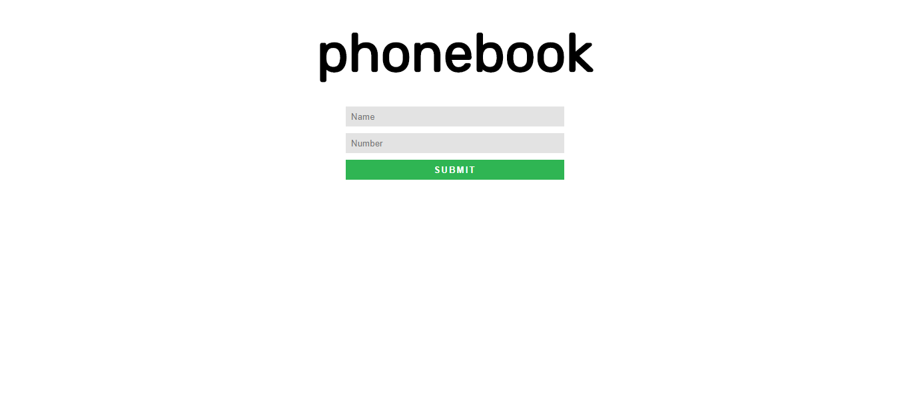
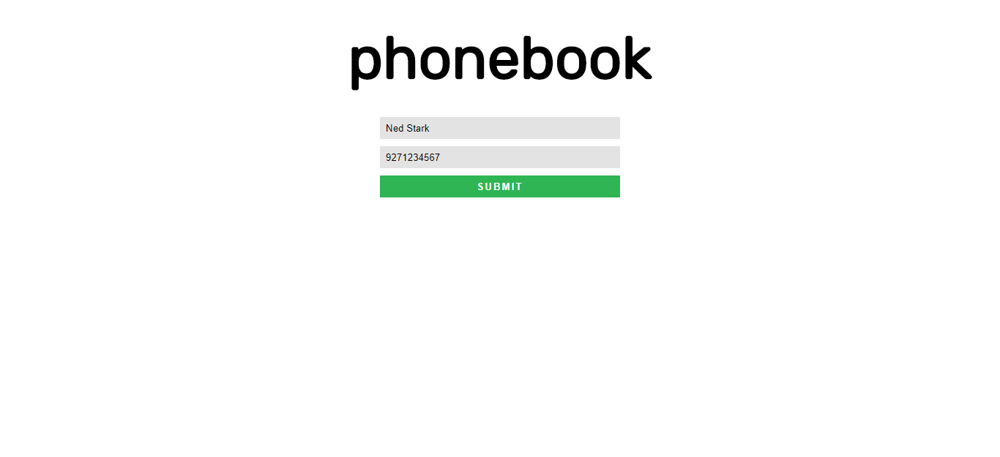
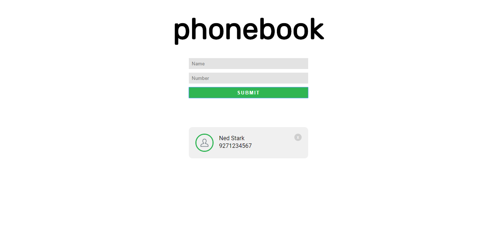
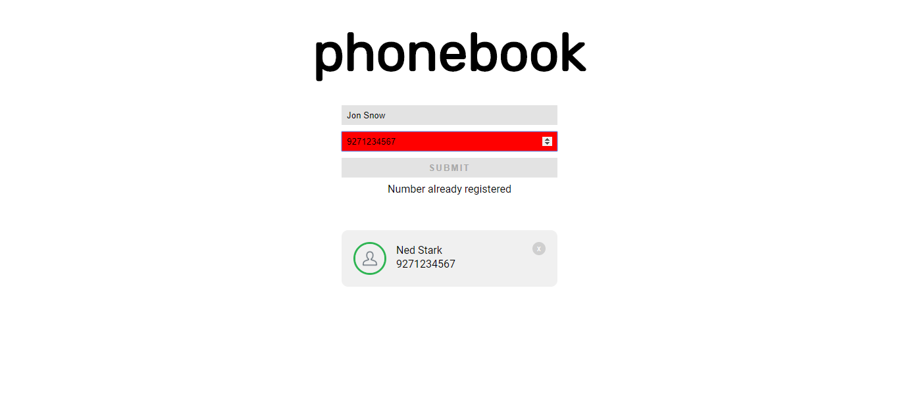

# ccapdev-mc03
Mini Challenge 3 for CCAPDEV1920T2

## General Instructions
- READ THE INSTRUCTIONS FIRST BEFORE PROCEEDING!
- You are provided with a skeleton code for this Mini-Challenge. You are **NOT ALLOWED** to modify any part of the code unless specified. Editable parts of code are marked with `TODO` comments.
- For any clarifications, ask your instructor

## Submission Details
- Fork this repository and submit the URL of the forked repository to AnimoSpace. If you know the internet will be slow, submit earlier to meet the deadline.

## Content
- [controllers](controllers) - This folder contains files which defines callback functions for client requests.
- [models](models) - This folder contains files for database modeling and access.
- [public](public) - This folder contains static assets such as css, js, and image files.
- [routes](routes) - This folder contains files which describes the response of the server for each HTTP method request to a specific path in the server.
- [views](views) - This folder contains all hbs files to be rendered when requested from the server.
- [index.js](index.js) - The main entry point of the web application.

## Challenge Description
You are to create a web application which simulates an online phonebook.

When a client requests for the root path, i.e. `/`, the server should display [`views/home.hbs`](views/home.hbs). Your web browser should display the screen below:

The web application accepts two inputs - a name and a number. When the user submits the form, the web application first checks if both fields are filled. Sample user input:

The web application then saves the values in the database, then display the values in `index.hbs`. Use [`views/partials/card.hbs`](views/partials/card.hbs) to render the `
` for each contact. Upon submitting the form, the contact should be displayed immediately **without refreshing the page**.

**HINT:** the client should communicate with the server **asynchronously**.

The picture below shows how the web application should display the values that we have entered earlier:

Each contact may be removed using the `X` button on the upper right of the `
`. Upon clicking the `X` button, the web application deletes the contact from the database then removes the corresponding `
` of the contact from [`views/home.hbs`](views/home.hbs). This operation should be done **without refreshing the page**.

Note that the number should be **UNIQUE** for each contact - no two contacts may have the same number. Thus, you are required to check if the current value entered by the user in the `number` text field has not yet been used by any other contact in the database. You need to check this **EVERY TIME** the user enters a number in the `number` text field.

If the current value in the `number` text field **IS IN THE DATABASE**:
- Change the background color of the `number` text field to `red`.
- Display the error message `Number already registered` in the `
` element in [`views/home.hbs`](views/home.hbs).
- Disable the `submit` button.

Else if the current value in the `number` text field **IS NOT YET IN THE DATABASE**:
- Change the background color of the `number` text field back to `#E3E3E3`
- Remove the error message in the `
` element in [`views/home.hbs`](views/home.hbs).
- Enable the `submit` button.

The picture below shows the changes in the form if the current value in the `number` text field is already in the database:

Upon refreshing the web application, all contacts in the database should be displayed.

You are already provided with the skeleton code organized in MVC architecture. Your task is to study the web application and complete the code of the files below. You are **NOT ALLOWED** to modify other files except the files below. Editable parts of code are marked with `TODO` comments, where you can insert your code.
- [`controllers/controller.js`](controllers/controller.js)
- [`models/UserModel.js`](models/UserModel.js)
- [`public/js/home.js`](public/js/home.js)
- [`views/home.hbs`](views/home.hbs)

Goodluck and stay safe! :sunglasses:
